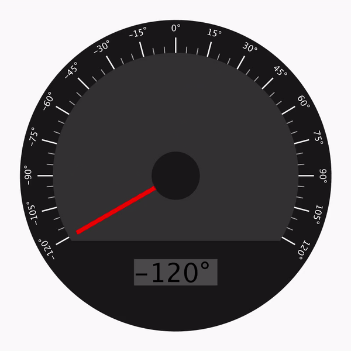

# Advanced Arduino
## Hello Processing
#### Included Files:
<a href="HelloProcessing/HelloProcessing.pde">HelloProcessing</a>  
 
In this assignment I learned the basics of Processing. I made a circle that bounced off the edges, and printed "Hello World". I proceeded to randomize color, direction, and size for a more engaging user experience.
  

  
## Arduino to Processing
#### Included Files:
<a href="ProcessingFromArduino/ProcessingFromArduino.pde">ProcessingFromArduino</a>  
<a href="ArduinoToProcessing/ArduinoToProcessing.ino">ArduinoToProcessing</a>  
 
In this assignment I used Processing and Arduino to display the input from a potentiometer using a dial. The Arduino side was easy, just serial printing the reading from a potentiometer. The Processing side was a little more complex. I read the value from the Arduino, and mapped it from -120° to 120°. I used that value and the sine and cosine function to calculate the x and y coordinates of the tip of the dial, and drew a dial with degrees marked behind the needle.
  

## Processing to Arduino
#### Included Files:
<a href="ProcessingToArduino/ProcessingToArduino.pde">ProcessingToArduino</a>  
<a href="ArduinoFromProcessing/ArduinoFromProcessing.ino">ArduinoFromProcessing</a>  
 
In this assignment I used a GUI in Processing to make an arduino control a servo. This assignment was the opposite of the last, this time sendin serial data from Processing to an Arduino. This assignment took a while because I didn't know how to read serial data on the Arduino. Other than this, it was mostly straightforward, just turning a servo.
  

